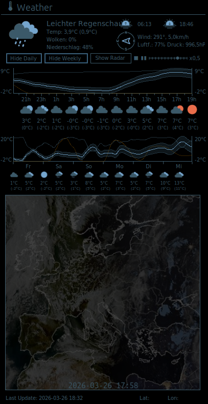

# Conky Weather Widget

A Weather Widget for Conky using [wttr.in](https://github.com/chubin/wttr.in) for Weather-Data and [dwd.de](dwd.de) for Rain Radar Images from Germany.

 

The Charts show the baseline Temperature in light blue with an randomly estimated error rate, filled in a darker blue. The orange line indicates the chance of precipitation and the single darker blue line the humidity. The vertical red line shows the current time. 

The Radar Image is shown as an animation of the Images from the last 60 minutes

## Setup Weather Data

`wttr.in` tries to fetch the right Weather Info based on you IP by default. If that isn't sufficient, you can add the Location in the `weather.conky` like so: 

    ${texecpi 60 ~/.conky/weather-widget/weather.sh YOUR_LOCATION_NAME}

## Setup Radar View

To set up the Radar View edit the `weather.sh` and specify your `REGION` in line 21:

    get_and_crop_radar_log=$($HOME/.conky/weather-widget/get_and_crop_radar_image.sh "REGION" "DETAIL_VIEW_X" "DETAIL_VIEW_Y")

For available `REGION`s check the [DWD Homepage](https://www.dwd.de/DE/leistungen/radarbild_film/radarbild_film.html)

If `DETAIL_VIEW_X` and `DETAIL_VIEW_Y` are specified, a 3x zoomed, 150x150px detail view from the specified coordinates will be shown in the upper left corner (see preview).

Also edit the `./lua/Main.lua` at line 123 & 124 to show a target indicator at your location:

    local target_x = %YOUR_HOME_X% + x
    local target_y = %YOUR_HOME_Y% + y

## Temp Folders and Files

You might need to create these Folders for the Radar Images:

    ./gif_frames
    ./gif_frames_edit
    ./gif_frames_raw

And these Files:

    ./weatherinfo.txt
    ./last_update.txt