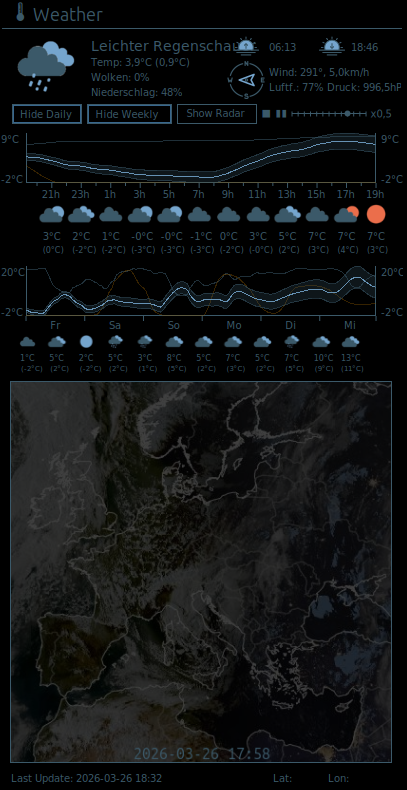

# Conky Weather Widget

A Weather Widget for [Conky](https://github.com/brndnmtthws/conky) using [wttr.in](https://github.com/chubin/wttr.in) or [open-meteo.com](https://open-meteo.com) for Weather-Data and [dwd.de](https://dwd.de) for Rain Radar Images from Germany and [EUMETSAT](https://www.eumetsat.int/) for Satellite Images. The widget respects the free rate-limits of these Services, so no API-Keys are needed.

 

The Charts show the baseline Temperature in light blue with an randomly estimated error rate, filled in a darker blue. The orange line indicates the chance of precipitation and the single darker blue line the humidity. Mouseover shows the Temperature at the given Time.

The Radar Image is shown as an animation of the Images from the last 60 minutes in 5min steps. The Satellite animation shows the last 2 Hours in 10min steps.

Icons are based on [OpenWeatherMap Icons](https://github.com/rodrigokamada/openweathermap)

## General Setup

Move these files to `~/.conky/weather-widget/` and install lua-json and imagemagick.

    sudo apt install lua-json
    sudo apt install imagemagick

## Setup Weather Data

You can choose between wttr.in and open-meteo.com as Providers for the Weather Data. For Europe, open-meteo seems to be the better provider.

### wttr.in

`wttr.in` tries to fetch the right Weather Info based on you IP by default. If that isn't sufficient, you can specify the Location in the `settings.properties` as `location_name`. To use the widget, edit the `weather.conky`: 

    lua_load = '~/.conky/weather-widget/lua/WttrWeatherWidget.lua'

### open-meteo.com

For `open-meteo.com` you need to specify your Lat/Lon coordinates in the `settings.properties`. You might want to search for the correct coordinates using https://open-meteo.com/en/docs as open-meteo seems to map the coordinates to those of the nearest station which might not always be the best fit. Edit in the weather.conky

    lua_load = '~/.conky/weather-widget/lua/OpenMeteoWeatherWidget.lua'

## Setup Radar View

To set up the Radar View edit the `region_name` in the `settings.properties`
For available regions, check the [DWD Homepage](https://www.dwd.de/DE/leistungen/radarbild_film/radarbild_film.html)

If `detail_x` and `detail_y` are specified, a 3x zoomed, 150x150px detail view from the specified coordinates in the original image (at `./gif_frames_raw/latest_radar_view.png`) will be shown in the upper left corner (see preview).
Use `detail_target_x`and `detail_target_y` to specify the coordinates of a target indicator in the final image.

## Satellite View

For the Satellite View the `get_satellite_image.sh` script gets the latest Image from the [EUMETSAT's GeoColour RGB - MTG - 0 degree](https://view.eumetsat.int/productviewer/productDetails/mtg_fd:rgb_geocolour?v=mtg_fd:rgb_geocolour) Product, that combines Satellite Data from ESA with NASA's Black Marble static background for the night. The Source is a geostationary Satellite at 0°, that covers Europe, Africa and parts of the Middle East and South America and produces a new Image every 10 minutes. I adjusted the API request to show an Image of Europe.

## Temp Folders and Files

You might need to create these Folders for the Radar Images:

    ./gif_frames
    ./gif_frames_edit
    ./gif_frames_raw

And the Satellite Images:

    ./eu_gif_frames
    ./eu_gif_frames_raw

And these Files:

    ./weatherinfo.json
    ./last_update.txt

## Changing the Colors

You can use the `./icons/owm-icons-blue/convert_color.sh`, `./icons/owm-icons-blue/convert_color.sh` and `./icons/arrow/rotate_img.sh` scripts to bulk edit the icon colors. Then edit the `./weather.conky` and `.lua` files in `./lua/`

## AI Disclaimer

I used some AI to check the code for memory leaks and create some parts of the code, since lua is new to me. So there are still memory leaks and the code is bad in many places.